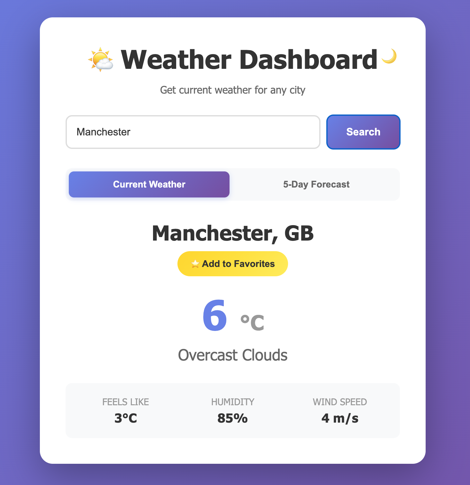
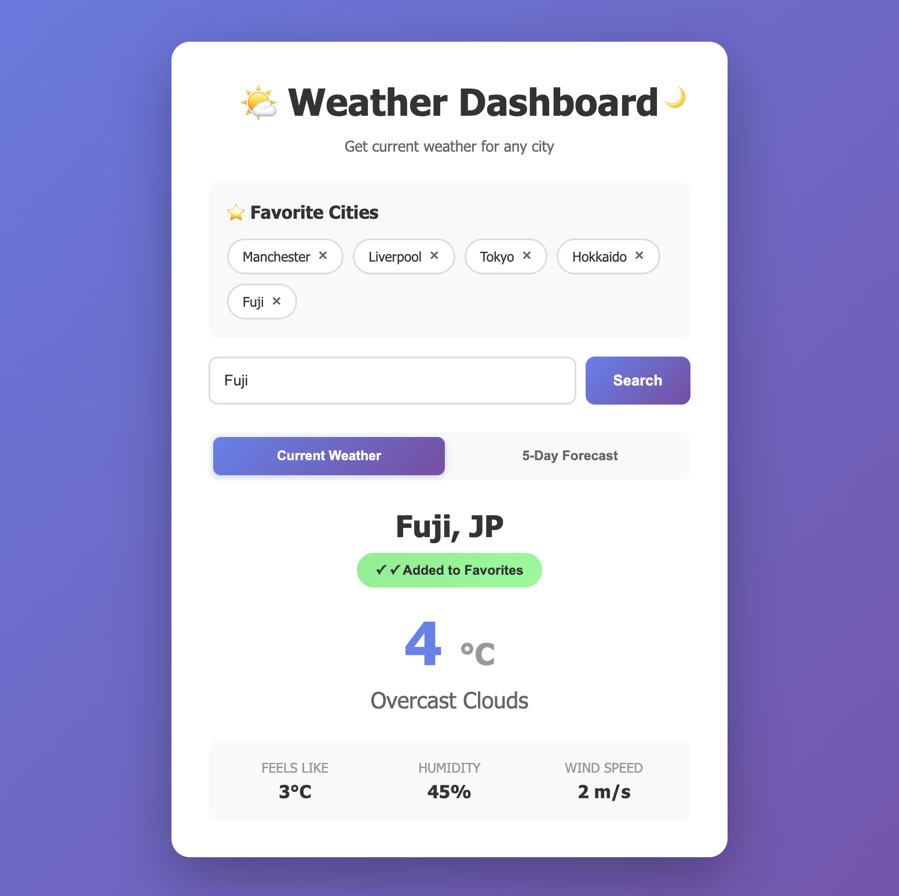
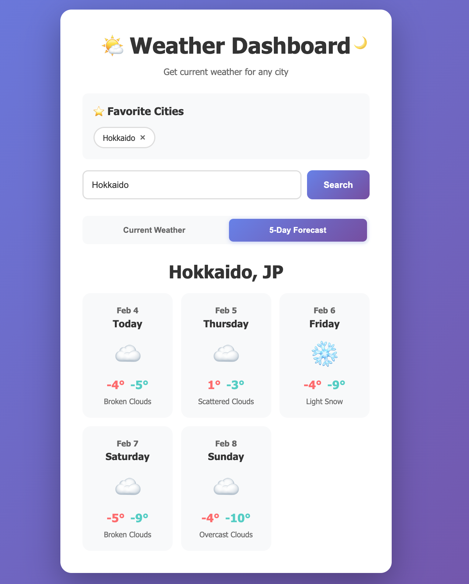
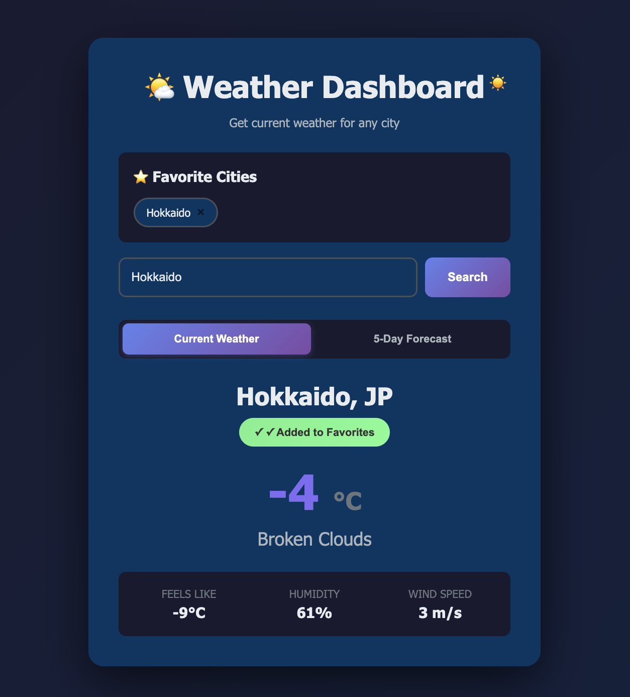

# 🌤️ Weather Dashboard

A modern, feature-rich weather application built with vanilla JavaScript, featuring current weather data, 5-day forecasts, dark mode, and personalized favorite cities.


**Live Demo:** [https://weather-dashboard-five-rust.vercel.app/](https://weather-dashboard-five-rust.vercel.app/) 

---

## 📋 Table of Contents

- [Features](#features)
- [Screenshots](#screenshots)
- [Technologies Used](#technologies-used)
- [Architecture](#architecture)
- [Getting Started](#getting-started)
- [API Configuration](#api-configuration)
- [Usage Guide](#usage-guide)
- [Project Structure](#project-structure)
- [Security](#security)
- [Performance](#performance)
- [Future Enhancements](#future-enhancements)
- [Learning Journey](#learning-journey)
- [License](#license)
- [Acknowledgments](#acknowledgments)

---

## ✨ Features

### 🌡️ Current Weather
- **Real-time weather data** from OpenWeatherMap API
- Current temperature with "feels like" reading
- Humidity levels
- Wind speed
- Weather conditions with descriptions
- Automatic city/country identification

### 📅 5-Day Forecast
- **Extended weather predictions** with daily breakdowns
- Daily high and low temperatures
- Weather condition icons
- Visual forecast cards with smooth animations
- Easy toggle between current and forecast views

### 🌓 Dark Mode
- **Seamless theme switching** between light and dark modes
- Smooth color transitions
- Persistent preference storage (remembers your choice)
- Optimized for readability in both themes
- Reduced eye strain for night-time usage

### ⭐ Favourite Cities
- **Save up to 5 favourite cities** for quick access
- One-click weather loading from favourites
- Add/remove cities with intuitive UI
- Persistent storage across sessions
- Visual feedback on favorite status

### 🔒 Security
- **API keys hidden** on serverless backend
- No exposed credentials in client code
- Secure Vercel serverless functions
- Input validation and error handling
- CORS protection

### 🎨 User Experience
- **Responsive design** - works on desktop, tablet, and mobile
- Clean, modern interface
- Smooth animations and transitions
- Loading states with visual feedback
- Clear error messages
- Keyboard support (Enter to search)
- Accessible UI components

---

## 📸 Screenshots

### Light Mode - Current Weather

*Clean, modern weather display with intuitive interface*

### Favourite Cities

*Save up to 5 cities for quick access - persistent across sessions*

### 5-Day Forecast

*Extended weather predictions with daily highs, lows, and conditions*

### Dark Mode

*Easy on the eyes - beautiful dark theme with smooth transitions*

---

## 🛠️ Technologies Used

### Frontend
- **HTML5** - Semantic structure and accessibility
- **CSS3** - Modern styling with CSS variables, Flexbox, Grid
- **Vanilla JavaScript (ES6+)** - No frameworks, pure JavaScript
  - Async/await for API calls
  - LocalStorage for data persistence
  - DOM manipulation
  - Event handling

### Backend
- **Vercel Serverless Functions** - API proxy layer
- **Node.js** - Runtime environment
- **Environment Variables** - Secure credential storage

### APIs
- **OpenWeatherMap API** - Current weather data
- **OpenWeatherMap Forecast API** - 5-day predictions

### DevOps
- **Git** - Version control
- **GitHub** - Code repository and collaboration
- **Vercel** - Deployment and hosting with auto-deploy

---

## 🏗️ Architecture

### Application Flow

```
┌─────────────────────────────────────────────────────────────┐
│                        User Interface                        │
│  (HTML/CSS/JavaScript - Single Page Application)            │
└─────────────────────────┬───────────────────────────────────┘
                          │
                          ├─── Current Weather Request
                          │    └──> /api/weather?city=London
                          │
                          ├─── Forecast Request
                          │    └──> /api/forecast?city=London
                          │
                          └─── Local Storage
                               ├──> Favorites
                               └──> Theme Preference
                          
┌─────────────────────────┴───────────────────────────────────┐
│              Vercel Serverless Functions                     │
│  ┌──────────────────┐         ┌──────────────────┐         │
│  │  weather.js      │         │  forecast.js     │         │
│  │  - Validates     │         │  - Validates     │         │
│  │  - Proxies       │         │  - Proxies       │         │
│  │  - Returns JSON  │         │  - Returns JSON  │         │
│  └────────┬─────────┘         └────────┬─────────┘         │
└───────────┼──────────────────────────────┼──────────────────┘
            │                              │
            │  API Key from ENV            │
            │  (Hidden from client)        │
            │                              │
┌───────────┴──────────────────────────────┴──────────────────┐
│                  OpenWeatherMap API                          │
│  - Current Weather Endpoint                                  │
│  - 5-Day Forecast Endpoint                                   │
└──────────────────────────────────────────────────────────────┘
```

### Security Architecture

**Client Side:**
- No API keys exposed
- Input validation
- Error handling
- HTTPS only

**Server Side (Vercel Functions):**
- API keys stored as environment variables
- Request validation
- CORS headers
- Error responses

---

## 🚀 Getting Started

### Prerequisites

- Modern web browser (Chrome, Firefox, Safari, Edge)
- Text editor (VS Code recommended)
- OpenWeatherMap API key (free tier)
- GitHub account
- Vercel account (free tier)

### Installation

#### 1. Clone the Repository

```bash
git clone https://github.com/davidetfabbrica/weather-dashboard.git
cd weather-dashboard
```

#### 2. Get Your OpenWeatherMap API Key

1. Visit [OpenWeatherMap](https://openweathermap.org/api)
2. Sign up for a free account
3. Navigate to "API Keys" section
4. Copy your API key

#### 3. Deploy to Vercel

**Option A: Using Vercel Dashboard (Recommended for beginners)**

1. Go to [vercel.com](https://vercel.com)
2. Sign in with GitHub
3. Click "Import Project"
4. Select your `weather-dashboard` repository
5. Click "Deploy"
6. After deployment, go to "Settings" → "Environment Variables"
7. Add:
   - **Key:** `OPENWEATHER_API_KEY`
   - **Value:** *Your API key from step 2*
8. Redeploy the project

**Option B: Using Vercel CLI**

```bash
# Install Vercel CLI
npm install -g vercel

# Login to Vercel
vercel login

# Deploy
vercel

# Add environment variable
vercel env add OPENWEATHER_API_KEY

# Redeploy to use new environment variable
vercel --prod
```

#### 4. Access Your App

Your app will be live at: `https://your-project-name.vercel.app`

---

## 🔐 API Configuration

### Environment Variables

Set these in your Vercel project settings:

| Variable | Description | Required |
|----------|-------------|----------|
| `OPENWEATHER_API_KEY` | Your OpenWeatherMap API key | Yes |

### API Endpoints

The application uses two serverless functions:

**Current Weather:**
```
GET /api/weather?city={cityName}
```

**5-Day Forecast:**
```
GET /api/forecast?city={cityName}
```

Both endpoints:
- Accept city name as query parameter
- Return JSON response
- Handle errors gracefully
- Include CORS headers

---

## 📖 Usage Guide

### Searching for Weather

1. **Enter a city name** in the search box
2. Click "Search" or press Enter
3. View current weather data
4. Toggle between "Current Weather" and "5-Day Forecast"

### Managing Favorites

1. **Add to favorites:** Search for a city, then click "⭐ Add to Favorites"
2. **Access favorites:** Click any city in the favorites list for instant weather
3. **Remove favorites:** Click the "×" next to any favorite city
4. **Limit:** Maximum 5 favorite cities

### Using Dark Mode

1. **Toggle theme:** Click the 🌙 (moon) or ☀️ (sun) icon in the top right
2. **Automatic persistence:** Your preference is saved automatically
3. **Applies everywhere:** Dark mode affects all views (current, forecast, favorites)

### Viewing 5-Day Forecast

1. **Search for a city** first
2. Click **"5-Day Forecast"** button
3. View daily predictions with highs, lows, and conditions
4. Click **"Current Weather"** to return to current conditions

---

## 📁 Project Structure

```
weather-dashboard/
├── api/
│   ├── weather.js           # Serverless function for current weather
│   └── forecast.js          # Serverless function for 5-day forecast
├── index.html               # Main application (HTML + CSS + JavaScript)
├── README.md                # Project documentation
├── LICENSE                  # MIT License
└── .gitignore              # Git ignore rules
```

### File Descriptions

**`index.html`** - Single-page application containing:
- HTML structure
- CSS styling with dark mode support
- JavaScript application logic
- API integration
- LocalStorage management

**`api/weather.js`** - Serverless function that:
- Receives city name from frontend
- Fetches current weather from OpenWeatherMap
- Returns formatted JSON response
- Handles errors and validation

**`api/forecast.js`** - Serverless function that:
- Receives city name from frontend
- Fetches 5-day forecast from OpenWeatherMap
- Returns formatted JSON response with 3-hour intervals
- Handles errors and validation

---

## 🔒 Security

### Implemented Security Measures

✅ **API Key Protection**
- API keys stored as environment variables on Vercel
- Never exposed to client-side code
- Serverless functions act as secure proxy

✅ **Input Validation**
- City name validation before API calls
- Error handling for invalid inputs
- Prevention of empty searches

✅ **CORS Protection**
- Proper CORS headers on serverless functions
- Restricted to specific methods (GET only)

✅ **HTTPS Only**
- Vercel provides automatic HTTPS
- All API calls encrypted

✅ **Error Handling**
- Graceful degradation on API failures
- User-friendly error messages
- No sensitive information in error responses

### Known Limitations

⚠️ **Rate Limiting**
- Free tier: 1,000 calls/day
- No built-in rate limiting in application
- Consider caching for high-traffic scenarios

⚠️ **LocalStorage**
- Favorites stored in browser only
- Not synced across devices
- Cleared if browser data is cleared

---

## ⚡ Performance

### Optimization Techniques

- **Lazy loading:** Weather data fetched on demand
- **Minimal dependencies:** No external JavaScript libraries
- **CSS transitions:** Hardware-accelerated animations
- **Efficient DOM updates:** Targeted element manipulation
- **LocalStorage caching:** Theme and favorites persist locally

### Load Time

- **Initial load:** < 1 second (HTML + CSS + JS)
- **API response:** 200-500ms (varies by location)
- **Theme toggle:** Instant (pure CSS)

---

## 🔮 Future Enhancements

### Potential Features

- [ ] **Hourly forecast** - More granular weather predictions
- [ ] **Weather maps** - Interactive radar and satellite imagery
- [ ] **Geolocation** - Auto-detect user's current location
- [ ] **Unit toggle** - Switch between Celsius/Fahrenheit
- [ ] **Weather alerts** - Severe weather notifications
- [ ] **Historical data** - Past weather trends
- [ ] **Multiple languages** - Internationalization support
- [ ] **Weather widgets** - Embeddable components
- [ ] **User authentication** - Sync favorites across devices
- [ ] **PWA support** - Install as mobile app
- [ ] **Offline mode** - Cache recent searches
- [ ] **Weather comparison** - Side-by-side city comparison
- [ ] **Custom themes** - User-defined color schemes
- [ ] **Voice search** - Search cities by voice
- [ ] **Share weather** - Generate shareable links

### Scalability Considerations

**If scaling to production:**
- Implement request caching (Redis)
- Add rate limiting per user
- Use database for user favorites
- Implement analytics
- Add comprehensive error logging
- Set up monitoring and alerts

---

## 🎓 Learning Journey

This project was built as a learning exercise, progressing through:

### Phase 1: Foundations
- Basic HTML/CSS structure
- API integration
- Async JavaScript

### Phase 2: Enhanced Features
- Dark mode implementation
- LocalStorage usage
- State management

### Phase 3: Advanced Functionality
- Serverless functions
- Environment variables
- Multiple API endpoints
- Complex data processing

### Phase 4: Polish & Deployment
- Responsive design
- Error handling
- Production deployment
- Documentation

### Key Concepts Learned

**Frontend Development:**
- CSS Variables for theming
- Flexbox and Grid layouts
- Smooth CSS transitions
- DOM manipulation
- Event handling
- Async/await patterns
- LocalStorage API

**Backend Development:**
- Serverless architecture
- API proxying
- Environment variables
- Error handling
- CORS configuration

**DevOps & Deployment:**
- Git version control
- GitHub workflows
- Vercel deployment
- Environment management
- CI/CD basics

**Best Practices:**
- Semantic HTML
- CSS organization
- JavaScript modularity
- Code documentation
- Error handling
- Security considerations

---

## 🤝 Contributing

Contributions are welcome! Here's how you can help:

### Reporting Bugs

1. Check existing issues to avoid duplicates
2. Provide detailed reproduction steps
3. Include browser/OS information
4. Attach screenshots if applicable

### Suggesting Features

1. Open an issue with the "enhancement" label
2. Describe the feature clearly
3. Explain use cases and benefits
4. Consider implementation complexity

### Pull Requests

1. Fork the repository
2. Create a feature branch (`git checkout -b feature/AmazingFeature`)
3. Commit your changes (`git commit -m 'Add some AmazingFeature'`)
4. Push to the branch (`git push origin feature/AmazingFeature`)
5. Open a Pull Request

### Code Style

- Use meaningful variable names
- Comment complex logic
- Follow existing formatting patterns
- Test thoroughly before submitting

---

## 📄 License

This project is licensed under the MIT License - see the [LICENSE](LICENSE) file for details.

**MIT License Summary:**
- ✅ Commercial use
- ✅ Modification
- ✅ Distribution
- ✅ Private use
- ⚠️ Liability and warranty limitations apply

---

## 🙏 Acknowledgments

### APIs & Services
- **[OpenWeatherMap](https://openweathermap.org/)** - Weather data provider
- **[Vercel](https://vercel.com/)** - Serverless hosting platform
- **[GitHub](https://github.com/)** - Code repository and version control

### Learning Resources
- **[MDN Web Docs](https://developer.mozilla.org/)** - Web development documentation
- **[CSS-Tricks](https://css-tricks.com/)** - CSS techniques and inspiration
- **[JavaScript.info](https://javascript.info/)** - Modern JavaScript tutorials
- **Claude (Anthropic)** - AI pair programming assistance

### Design Inspiration
- Modern weather app UIs
- Dark mode design patterns
- Minimalist web design principles

---

## 📞 Contact & Links

**Developer:** DavideT Fabbrica  
**Project Repository:** [https://github.com/davidetfabbrica/weather-dashboard](https://github.com/davidetfabbrica/weather-dashboard)  
**Live Demo:** [[Your Vercel URL here](https://weather-dashboard-five-rust.vercel.app/)](https://weather-dashboard-five-rust.vercel.app/)  
**Project Roadmap:** [GitHub Projects](https://github.com/users/davidetfabbrica/projects/2)

---

## 🌟 Star This Project

If you found this project helpful or interesting, please consider giving it a ⭐ on GitHub!

---

**Built as part of a suite of ongoing Claude Code experimentation projects**

*Last updated: February 2026*
